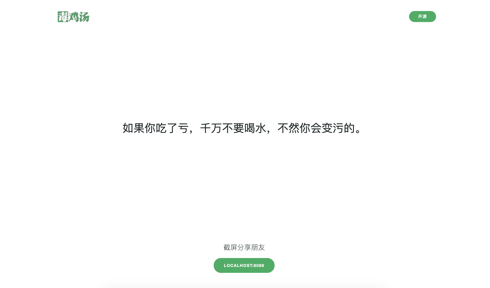

# 毒鸡汤 - Go
壮士可要来一碗！

## 安装
[Download](https://github.com/telanflow/dujt/releases)
下载可执行文件到 dujt 根目录执行即可。

## Usage
```
➜  ./darwin_amd64 -h

Usage of ./darwin_amd64:
  -addr string
        服务地址 (default "0.0.0.0")
  -port string
        服务端口 (default "80")
``` 

## 对于维护：
1. data/data.go加一条文本、重新编译一下Go程序即可。编译代码已经在项目下：sh ./build.sh
2. 需要结束程序  直接 kill 即可
3. Go程序后台执行，由于我没有写此功能，so 可以借助第三方实现：

> 守护进程管理工具：supervisor

> Linux窗口管理工具：screen

> linux_amd64 -addr 0.0.0.0 -port 80 > /dev/null 2>&1

## 变量含义 (web/index.html)
    url: http://localhost
    host: localhost
    line: 毒鸡汤语句

## 预览图


## 感谢
[原版毒鸡汤 PHP](https://github.com/egotong/nows)
